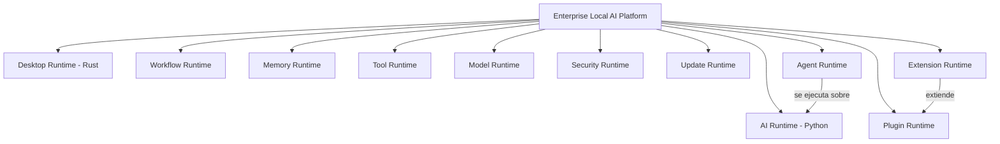
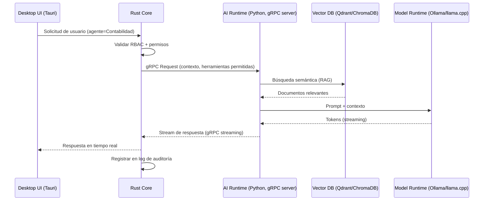
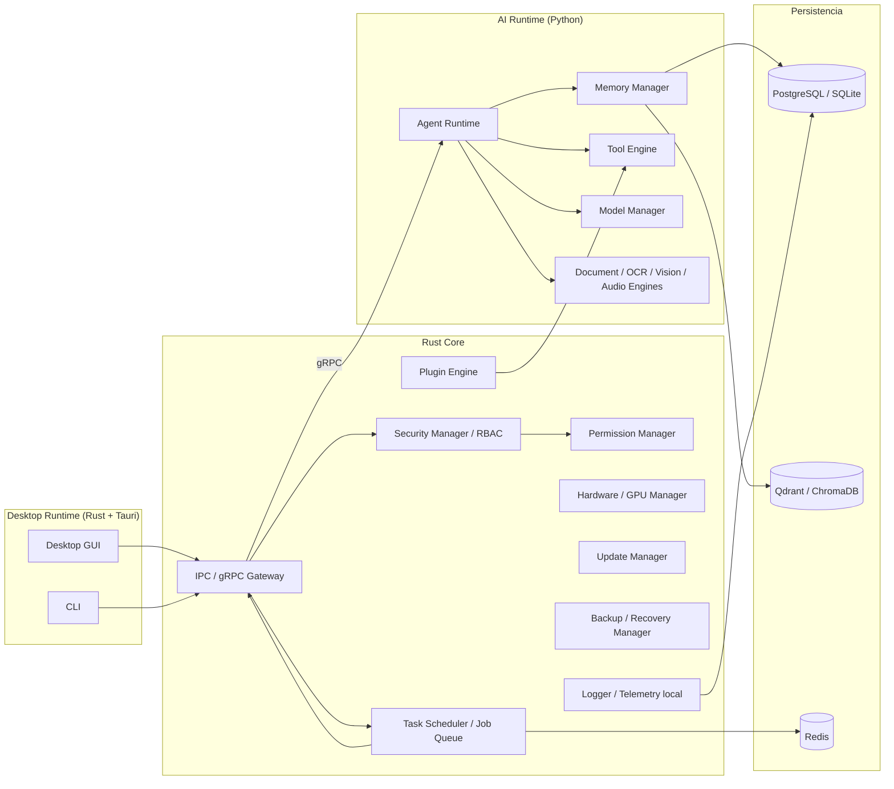

# Libro 4 — Software Architecture Document (SAD)
## Enterprise Local AI Platform (ELAP)

**Versión:** 1.0 | **Depende de:** Libro 3 (SRS) | **Patrón de referencia:** Hexagonal / Clean Architecture + Runtime-oriented design

---

## 1. Objetivo

Definir la arquitectura de software completa de ELAP: estilo arquitectónico, componentes, fronteras de responsabilidad, comunicación entre procesos y justificación de cada decisión tecnológica con sus alternativas descartadas.

## 2. Decisión arquitectónica raíz: diseño orientado a Runtimes, no a agentes

**Decisión:** el sistema no se organiza alrededor de "agentes" como concepto central, sino alrededor de un conjunto de **Runtimes** independientes. Los agentes son plugins que se ejecutan sobre el AI Runtime.

**Justificación:** un diseño centrado en agentes obliga a rediseñar el núcleo cada vez que aparece una nueva capacidad (workflows, automatización, robótica). Un diseño centrado en runtimes permite añadir capacidades nuevas como runtimes adicionales sin tocar el core.

## 3. Estilo arquitectónico general

- **Patrón macro:** arquitectura hexagonal (puertos y adaptadores) a nivel de cada runtime, para que la lógica de negocio no dependa de frameworks concretos.
- **Comunicación:** arquitectura orientada a procesos independientes comunicados por IPC, no monolito ni microservicios web clásicos (ver sección 6).
- **Principio rector:** Rust = plataforma, rendimiento, sistema operativo. Python = exclusivamente IA y su ecosistema. Ver sección 5.

## 4. Comparativa de lenguajes (decisión fundacional)

| Criterio | Rust | Go | Python |
|---|---|---|---|
| Rendimiento | Muy alto | Alto | Bajo |
| Concurrencia | Muy alta (Tokio, Rayon) | Muy alta | Media |
| Consumo de memoria | Muy bajo | Bajo | Alto |
| Ecosistema IA/ML | Limitado | Muy limitado | Excelente |
| Acceso a hardware/SO | Excelente | Medio | Bajo |
| Seguridad de memoria | Garantizada en compilación | Garbage collector | Garbage collector |
| Curva de aprendizaje | Alta | Baja | Baja |

**Decisión:** se descarta Go como tercer lenguaje del núcleo. Aunque es idóneo para APIs REST y microservicios, introducir un tercer ecosistema de build/dependencias (cargo + pip + go mod) añade complejidad de mantenimiento sin resolver una necesidad que Rust no cubra ya (Tokio, Rayon, Crossbeam para concurrencia). Go queda reservado como opción aislada solo si en el futuro aparece un caso muy específico donde aporte valor claro y esté desacoplado del núcleo.

## 5. Frontera de responsabilidad Rust ↔ Python

| Responsabilidad | Lenguaje | Motivo |
|---|---|---|
| Núcleo de la aplicación / lifecycle | Rust | Estabilidad, rendimiento, control de memoria |
| Concurrencia y scheduling de tareas | Rust | Tokio/Rayon superan a asyncio en throughput y seguridad |
| Gestión de procesos y plugins | Rust | Aislamiento y sandboxing seguro |
| Interfaz con el sistema operativo (archivos, procesos, hardware) | Rust | Acceso de bajo nivel seguro |
| Seguridad (RBAC, cifrado, secretos) | Rust | Superficie de ataque menor, memory-safety |
| Instalador y actualizador | Rust | Binario único, sin runtime externo |
| Inferencia de modelos (LLM) | Python | Ollama/llama.cpp/vLLM/Transformers |
| RAG, embeddings, base vectorial | Python | Ecosistema maduro (LangChain, LangGraph, ChromaDB/Qdrant clients) |
| Visión artificial, audio, OCR | Python | OpenCV, Whisper, Piper |
| Orquestación de agentes (lógica de alto nivel) | Python | LangGraph facilita grafos de agentes |

**Regla explícita:** ninguna lógica de negocio crítica de seguridad vive en Python. Python es reemplazable/reiniciable de forma aislada sin comprometer el core.

## 6. Comunicación entre Rust y Python (IPC)

| Alternativa | Ventajas | Desventajas | Decisión |
|---|---|---|---|
| Bindings directos (PyO3) | Latencia mínima | Un crash de Python puede tumbar el proceso Rust; acoplamiento fuerte de versiones | Descartado como mecanismo principal |
| gRPC sobre socket local | Contratos tipados (protobuf), streaming nativo, aislamiento total de procesos | Mayor complejidad de setup inicial | **Elegido** |
| ZeroMQ | Muy ligero, flexible | Sin tipado de contrato, requiere protocolo propio | Descartado (complejidad adicional sin beneficio claro) |
| REST/HTTP local | Simplicidad, debug fácil con curl | Overhead de HTTP, sin streaming eficiente | Descartado como mecanismo primario, aceptable para herramientas admin |

**Decisión:** el AI Runtime (Python) se ejecuta como **proceso independiente**, expuesto vía **gRPC sobre socket local** (Unix domain socket en Linux, named pipe en Windows) con TLS/autenticación mutua. Beneficios directos:
- Si el proceso de IA falla, el núcleo Rust sigue operando (RNF-002, RNF-010).
- El servicio de IA puede reiniciarse/actualizarse sin recompilar ni detener el core.
- Contratos de API tipados vía Protocol Buffers, versionables independientemente.

## 7. Componentes de la plataforma

## 8. Inventario de componentes (resumen)

| Componente | Runtime | Responsabilidad |
|---|---|---|
| Core Engine | Rust | Lifecycle general de la aplicación |
| Plugin Engine / Extension Manager | Rust | Carga, sandboxing y ciclo de vida de plugins |
| Workflow Engine | Rust (orquesta) / Python (ejecuta lógica IA) | Encadenamiento de tareas multi-agente |
| Agent Runtime | Python | Ejecución de agentes sobre LangGraph |
| Memory Manager | Python | Memoria corta/larga, RAG, embeddings |
| Tool Engine | Rust (permisos) + Python (ejecución) | Registro y ejecución segura de herramientas |
| Configuration Manager | Rust | Configuración persistente y versionada |
| Permission Manager / RBAC | Rust | Control de acceso por usuario/agente/herramienta |
| Hardware / GPU Manager | Rust | Detección y asignación de recursos (CUDA/CPU) |
| Model Manager | Python | Carga/descarga de modelos, routing por agente |
| Task Scheduler / Job Queue | Rust (Tokio) | Programación y cola de tareas |
| Logger / Telemetría local | Rust | Observabilidad sin salida a internet |
| Update Manager | Rust | Actualizaciones firmadas del binario |
| Backup / Recovery Manager | Rust | Respaldo/restauración de configuración y memoria |
| Security Manager / Secrets Manager | Rust | Cifrado AES-256, gestión de secretos |
| IPC Layer | Rust ↔ Python | gRPC sobre socket local |
| Database Layer | Rust/Python (drivers) | PostgreSQL (multiusuario) / SQLite (modo pequeño) |
| Vector Database Layer | Python | Qdrant (producción) / ChromaDB (ligero) |
| Document / Vision / Audio / OCR Engine | Python | Procesamiento multimodal |

## 9. Persistencia: comparativa

| Motor | Uso | Ventajas | Desventajas | Cuándo usar |
|---|---|---|---|---|
| SQLite | Modo pequeño / single-user | Cero configuración, archivo único | Sin concurrencia alta | Instalación individual o piloto |
| PostgreSQL | Modo empresarial multiusuario | Concurrencia, robustez, extensiones | Requiere administración | Instalación empresarial (RNF-006) |
| Redis | Cache, colas | Muy rápido, soporta pub/sub | Volátil (requiere persistencia configurada) | Cache de sesión, cola de jobs |
| Qdrant | Vector DB producción | Rendimiento, filtrado avanzado, escrito en Rust | Proceso adicional a mantener | Instalaciones medianas/grandes |
| ChromaDB | Vector DB ligero | Embebible, simple | Menor rendimiento a gran escala | Prototipos, instalaciones pequeñas |

## 10. Despliegue como aplicación de escritorio (no web)

**Decisión:** shell de escritorio con **Tauri** (Rust) en lugar de Electron.

| Criterio | Tauri | Electron |
|---|---|---|
| Tamaño del binario | ~10–20MB | ~150MB+ |
| Consumo de RAM | Bajo (usa WebView del SO) | Alto (Chromium embebido) |
| Lenguaje del backend | Rust nativo | Node.js |
| Seguridad | Sandboxing más estricto por defecto | Requiere hardening manual |

## 11. Riesgos arquitectónicos y mitigación

| Riesgo | Impacto | Mitigación |
|---|---|---|
| Latencia de IPC gRPC entre Rust y Python | Medio | Streaming nativo de gRPC + benchmarking continuo (Libro 16) |
| Fallo del proceso Python (AI Runtime) | Alto si no se aísla | Proceso independiente + Update/Recovery Manager con reinicio automático (RNF-010) |
| Complejidad de mantener dos ecosistemas (cargo + pip) | Medio | Estándares de ingeniería estrictos (Libro 5) y CI/CD unificado (Libro 18) |
| Modelos locales con menor calidad que frontier cloud | Medio | Selección cuidadosa por caso de uso (Libro 7) + expectativas claras (Libro 1) |
| Escalabilidad limitada por hardware del cliente | Medio | Modo CPU-only + cuantización + guía de sizing (Libro 16) |

## 12. Alternativas descartadas (resumen ejecutivo)

- **Monolito Python puro:** descartado por rendimiento y seguridad de memoria en el núcleo.
- **Microservicios web clásicos (REST entre todos los componentes):** descartado como patrón por defecto; se usa localmente y de forma pragmática solo donde aporta valor (ver Libro 6), priorizando IPC de baja latencia.
- **Electron para el shell de escritorio:** descartado por consumo de recursos.
- **Go como tercer lenguaje del núcleo:** descartado (sección 4).

## 13. Checklist de aprobación

- [x] Frontera Rust/Python definida y justificada
- [x] Mecanismo de IPC decidido con alternativas comparadas
- [x] Diagrama de componentes y de secuencia completos
- [x] Persistencia definida para modo pequeño y modo empresarial
- [ ] Validación de latencia real con prototipo (pendiente — Fase 2)

---
**Siguiente documento sugerido:** Libro 15 (Security Architecture) o Libro 7 (AI Runtime Architecture), dado que son las piezas de mayor riesgo identificadas en este SAD.
